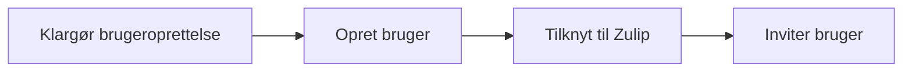

# Opret bruger

## Klargør brugeroprettelse

Når der er anmodet om oprettelse af en bruger skal du først og fremmest sikre dig at du har:
- brugerens fuldenavn
- brugerens email
- brugerens tilknytning til OS2 (medlemsstatus/observatør/leverandør/m.v)
- oplysning om hvilke produkt grupper brugeren skal tilknyttes

Når du har disse oplysninger klar kan du gå igang

## Opret Brugere - manuelt ( uden FKA integration)
Denne handling foretages i Authentic, af en bruger som har Administrations rettighed ( Brugertype: administrator eller Ejer )

Handlingen triggers af et Github request (jvf Anmod om bruger oprettelse)

Derudover genereres der et stærkt PW tilbrugeren i et dertil egnet værktøj, hvilket kunne være 1Password: [https://1password.com/password-generator](https://1password.com/password-generator)

Arbejdsgangen er som flg:
- [ ] Åben Authentic [https://authentik.os2samtale.open-public.org](https://authentik.os2samtale.open-public.org)
    - [ ] log ind med email og PW 
- [ ] Åben administrationsmodulet i Authentic -link i øverste højre hjørne [Admin Interface](https://authentik.os2samtale.open-public.org/if/admin/)
- [ ] Opret ny bruger Brugere
   - [ ]  Åben menupunktet Directory (tryk på pilen ud for menupunkt i den menu der er vist i venstre side af vinduet)
   - [ ]  Vælg undermenuen User
- [ ]  Opret ny bruger
   - [ ]  Vælg den grønne knap create (oven over listen af brugere)
   - [ ]  Udfyld pop op vinduet med flg
         - [ ]  Username : brugerens email addresse
         - [ ]  Name : brugerens fulde navn - for virksomheder inkluderes virksomheden i parantes efter navnet
         - [ ]  email:  brugerens email addresse
         - [ ]  attributter : bruges ikke direkte lige nu men vil følge senere   
   - [ ] tryk på knappen create
- [ ]  opret Password til Brugeren
  - [ ]  åben 1 pw strong PW generator [https://1password.com/password-generator](https://1password.com/password-generator)
  - [ ]  generer et stærkt PW
  - [ ]  åben Pass go [https://snap.dglive.net/](https://snap.dglive.net/)
  - [ ]  kopier det stærke PW ind i kanalen
  - [ ]  vælg funktionen generate url
  - [ ]  lad udløbsdato blive på 1 uge
  - [ ]  vælg funktionen copu Url
  - [ ]  tast Url's ind i mail til brugeren

## Tilknyt til Zulip
Denne handling foregår både i Authentic og i Zulip (indtil videre)
- [ ]  Tilknyt brugeren til Zulip
  - [ ]  Vælg menuen Groups ( under directory)
  - [ ]  vælg gruppen Zulip
  - [ ]  vælg Users i den vandrette menu i toppn
  - [ ]  Vælg funktionen Add eksisting user
  - [ ]  tryk på plusset i popup menuen
  - [ ]  vælg brugeren i listen ( marker i krydsfeltet)
  - [ ]  trykk add
- [ ]  Tilknyt brugeren til kanaler i Zulip
     - [ ] TBD
  
## Inviter Brugeren
Denne handling foretages ved at sende en mail fra OS2samtale@os2.eu
- [ ]  opret en mail til brugeren fra OS2Samtale@os2.eu
  - [ ]  Inkluder link til OS2samtale [https://os2samtale.os2.eu/](https://os2samtale.os2.eu/)
  - [ ]  informer om at brugernavnet er mailaddressen
  - [ ]  Inkluder link til secure Pasword (se opret pasword)
  - [ ]  informer om hvilke grupper brugeren er tilknyttet og hvilke brugerrettigheder denne har
  - [ ]  inkluder ling til code of conduct (når denne er på plads)
- [ ]    Opret evt en mail til den der har anmodet om at få brugeren oprettet og informer om at det er sket. 